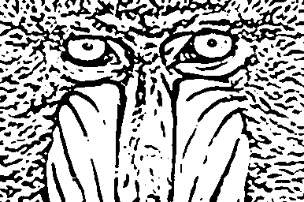

# Coherent Line Drawings
### [GitHub](https://github.com/dtxiong/Coherent-Line-Drawings)

This program is a filter that turns images into black and white line drawings. For computers with NVIDIA GPUs, there is a CUDA accelerated version that speeds the program up by around 500x, depending on the size of the image. 
This is an implementation of [Kang et al.](http://cg.postech.ac.kr/papers/kang_npar07_hi.pdf)

