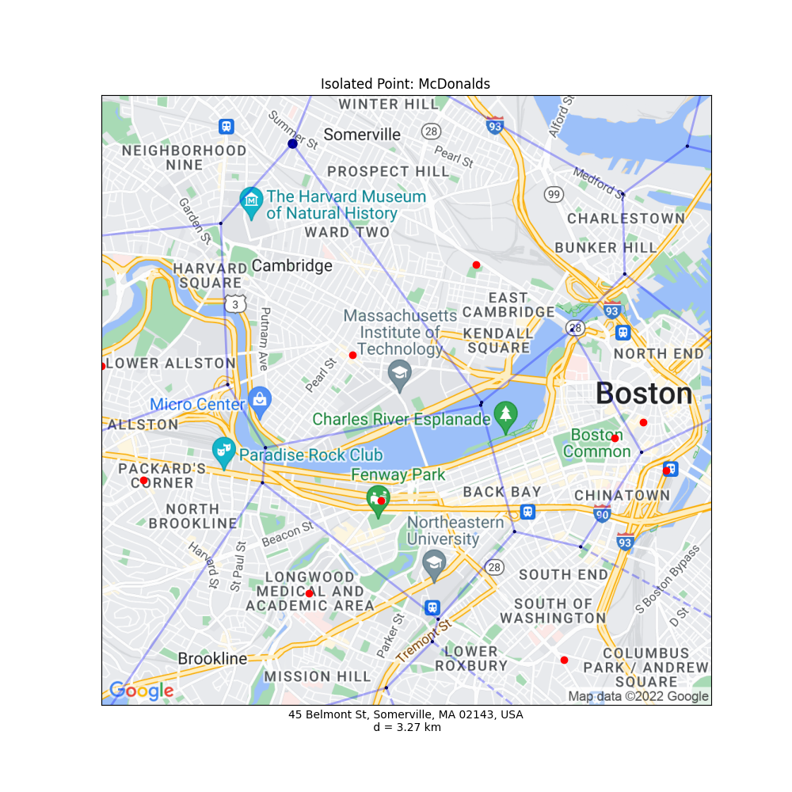

# Coherent Line Drawings
### [GitHub](https://github.com/dtxiong/Isolated-Points-in-Google-Maps)

This project is uses Voronoi diagrams to determine a set of most isolated points in Google maps. There are several applications for using this program. This isolated point can be used to determine the best location to place a new establishment. Many establishments benefit from being further away to similar establishments. For example, fast food restaurant chains benefit from being spread out from similar restaurants to prevent competition. Also, public services such as police stations and fire departments should be spread out to have quick access to all areas. In a similar vein, the isolated point is also the one which would take the longest to receive help, in case of emergencies. 

Shown below are two results of the program. The first picture finds the point most isolated from police stations in Cambridge. The second picture finds the point most isolated from McDonalds in Cambridge. The map of the Cambridge/Boston area is shown in the background, centered on MIT. In red, are the graphed locations of the existing sites. The Voronoi diagram is overlaid on the map in blue, and the most isolated point is shown by a large blue dot. 

  
   

